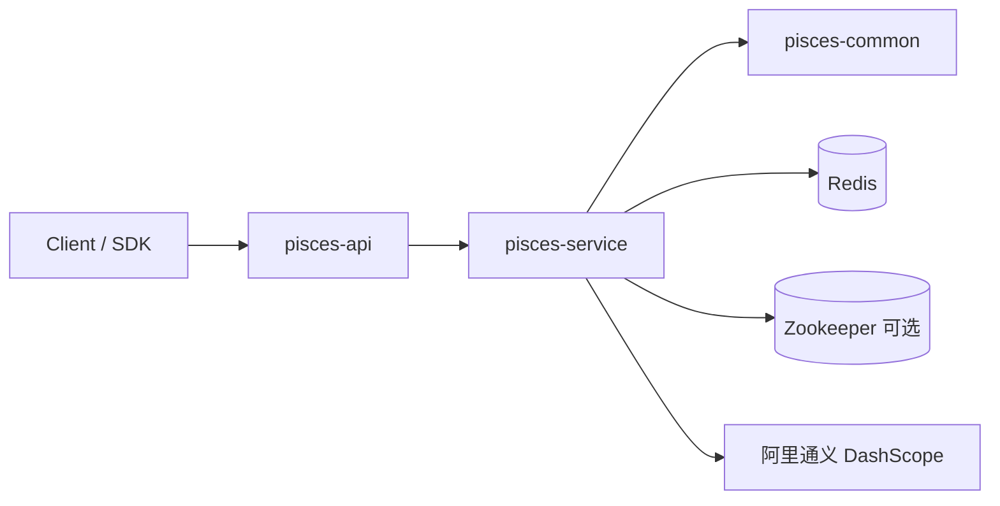

# Pisces 项目知识库

## 1. 项目定位

Pisces 是一个基于 Spring Boot 3.2 / Java 21 的 A/B 测试实验系统，主线能力包括：

- 实验配置与生命周期管理
- 访客分流与多臂老虎机动态分配
- 事件采集与统计分析
- 贝叶斯分析、样本量计算、SRM、序贯检验
- 接入阿里通义的文本/图像变体生成与 AI 解读

项目当前是单仓多模块 Maven 工程，主服务运行入口在 `pisces-service`，对外 HTTP API 在 `pisces-api`。

## 2. 模块总览

| 模块 | 角色 | 说明 |
| --- | --- | --- |
| `pisces-common` | 公共模型层 | 放置实体、DTO、响应体、错误码 |
| `pisces-service` | 业务服务层 | 实验管理、流量分配、数据采集、分析、AI 能力、Zookeeper/Redis 配置 |
| `pisces-api` | 接口层 | REST Controller、安全拦截、请求日志 |
| `pisces-sdk-java` | Java SDK | 独立目录，未纳入父 POM modules |
| `pisces-sdk-js` | JS SDK | 独立目录，文档存在，源码不在本次主工程模块内 |

## 3. 运行架构

关键事实：

- 应用启动类：`pisces-service/src/main/java/com/pisces/PiscesApplication.java`
- 默认端口：`9990`
- Context Path：`/api`
- Redis 用于分组缓存、事件存储、统计计数、MAB 参数、身份绑定
- Zookeeper 用于实验配置；不可用时由实验配置仓库承接，仓库可配置为内存或 MySQL
- 通义 API 用于文本/图像生成及 AI 分析，未配置 `tongyi.apiKey` 时相关能力直接失败

## 4. 核心业务链路

### 4.1 实验创建

1. `ExperimentController` 接收实验创建请求
2. `ExperimentServiceImpl` 组装 `ExperimentMetadata`
3. `ConfigServiceImpl` 保存到 Zookeeper，并同步写入实验配置仓库；仓库可选择内存或 MySQL

### 4.2 访客分流

1. `TrafficController` 接收 `experimentId + visitorId + 可选 attributes`
2. `TrafficServiceImpl` 读取实验配置并校验：
   - 状态必须是 `RUNNING`
   - 必须在实验起止时间内
   - 黑白名单
   - Layer 互斥
   - `configVersion` 命中的缓存是否有效
3. 按策略分配：
   - `HASH`
   - `RANDOM`
   - `RULE`，按请求属性做确定性规则命中
   - `THOMPSON_SAMPLING`
   - `UCB`

### 4.3 事件采集

1. `DataController` 可独立接收 `exposure`
2. `DataController` 接收事件
3. `DataServiceImpl` 根据访客当前所属组补齐 `groupId`
4. 事件写入 Redis List，计数写入 Redis Hash，访客去重写入 Redis Set
5. `CONVERT` 事件会触发 MAB 奖励更新

### 4.4 分析与 AI

1. `AnalysisServiceImpl` 从 `ConfigService + DataService` 聚合统计结果
2. 统计结果现在会附带 `dataQualityCheck`，明确给出 SRM、样本量、assignment / exposure 完整性
3. 显著性检验、贝叶斯早停、序贯检验、自动毕业都会读取 `dataQualityCheck`，门禁不通过时阻断决策
4. 主指标与护栏指标已接入统计摘要和自动毕业逻辑
5. 贝叶斯分析走 `BayesianAnalysisServiceImpl`
6. 因果推断走 `CausalInferenceServiceImpl`
7. HTE 走 `HTEAnalysisServiceImpl`
8. AI 解读、AI 实验设计、变体生成走通义 DashScope
9. 导出报告、推荐列表、完成时间预测已统一读取同一套决策上下文

## 5. 文档索引

- [架构与运行](architecture.md)
- [领域模型](domain-model.md)
- [API 清单](api-surface.md)
- [模块与代码地图](module-map.md)
- [实现状态与限制](implementation-status.md)

## 6. 快速判断项目现状

这不是一个“全部能力均已生产可用”的系统，当前更准确的判断是：

- 核心实验管理、分流、事件采集、基础统计：可运行
- 贝叶斯分析、样本量、SRM、序贯检验：已实现
- PSM：有基于事件构造的简化实现
- DID：有实现，但时间窗转化率计算仍带近似
- Causal Forest、HTE、敏感群体：明确禁止返回模拟结果，当前未真正落地
- 变体生成与 AI 解读：依赖外部通义 API，配置不完整时不可用
