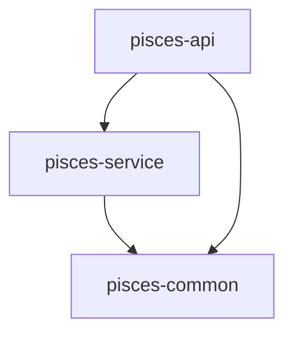
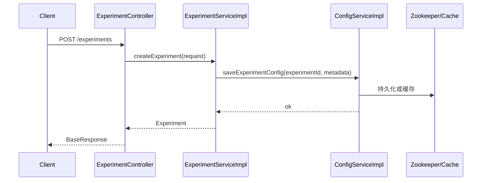
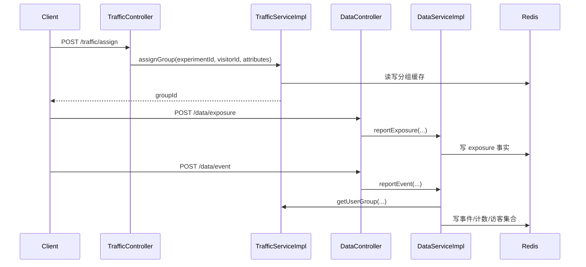

# 架构与运行

## 1. 工程结构

父工程 `pom.xml` 只聚合了 3 个核心模块：

- `pisces-common`
- `pisces-service`
- `pisces-api`

`pisces-sdk-java` 和 `pisces-sdk-js` 在仓库中存在，但不在父 POM `modules` 内，当前更像附属 SDK 目录。

## 2. 模块依赖

## 3. 配置与基础设施

配置文件：`pisces-service/src/main/resources/application.yml`

默认配置：

- `server.port = 9990`
- `server.servlet.context-path = /api`
- Redis：`localhost:6379`
- Zookeeper：`localhost:2181`
- 通义模型默认：`qwen-plus`
- 安全 Header：`X-Pisces-Api-Key`

## 4. 存储职责拆分

### 4.1 Zookeeper / 本地缓存

由 `ConfigServiceImpl` 管理：

- 实验元数据 `ExperimentMetadata`
- 分层配置 `ExperimentLayer`
- 配置监听与本地缓存失效
- 可切换的 MySQL 实验配置仓库

仓库规则：

- 实验配置仓库固定通过数据库持久化，不再提供内存实现
- 如果数据源或 `pisces_experiment_config` 表不可用，服务会直接启动失败
- 当前已提供建表 SQL：`pisces-service/src/main/resources/sql/mysql/pisces_experiment_config.sql`
- 数据库链路当前已统一改为 `repository -> mapper interface -> mapper.xml`，SQL 不再内嵌在 Java 代码中

### 4.2 MySQL

当前 MySQL 主要承担两类持久化职责：

- `pisces_experiment_config`：实验配置持久化
- `pisces_experiment_report_snapshot`：实验报告快照归档

代码结构已收口为：

- `repository`：领域语义仓库，对上层 Service 暴露 `save/find/list` 等业务能力
- `entity`：数据库行模型
- `mapper interface`：MyBatis 映射接口
- `mapper.xml`：唯一 SQL 定义位置

当前对应实现：

- `ExperimentConfigRepository` -> `DatabaseExperimentConfigRepository` -> `ExperimentConfigMapper` -> `ExperimentConfigMapper.xml`
- `ExperimentReportSnapshotRepository` -> `DatabaseExperimentReportSnapshotRepository` -> `ExperimentReportSnapshotMapper` -> `ExperimentReportSnapshotMapper.xml`

### 4.3 Redis

由 `TrafficServiceImpl`、`DataServiceImpl`、`MultiArmedBanditServiceImpl`、`IdentityServiceImpl` 共同使用。

主要 Key 约定：

- `pisces:traffic:group:{visitorId}`：访客分组缓存
- `pisces:assignment:{experimentId}:{visitorId}`：分流事实
- `pisces:assignment:set:{experimentId}:{groupId}`：实验组 assignment 去重集合
- `pisces:layer:assign:{layerId}:{visitorId}`：Layer 互斥标记
- `pisces:event:store:{experimentId}:{groupId}`：事件列表
- `pisces:event:counter:{experimentId}:{groupId}`：事件计数
- `pisces:visitor:set:{experimentId}:{groupId}`：访客去重集合
- `pisces:exposure:{experimentId}:{visitorId}`：曝光事实
- `pisces:exposure:set:{experimentId}:{groupId}`：实验组 exposure 去重集合
- `pisces:mab:beta:{experimentId}`：Thompson Sampling 参数
- `pisces:mab:ucb:{experimentId}`：UCB 统计
- `pisces:mab:trials:{experimentId}`：UCB 总尝试次数
- `pisces:identity:bind:{deviceId}`：deviceId -> userId

## 5. 请求处理横切逻辑

### 5.1 鉴权

`ApiKeyAuthInterceptor` 规则：

- 命中 `pisces.security.skip-paths` 放行
- 类或方法带 `@NoTokenRequired` 放行
- 其他接口要求请求头 `X-Pisces-Api-Key`

当前业务 Controller 基本都打了 `@NoTokenRequired`，因此主链路接口默认无需鉴权。

### 5.2 日志

日志链路由三部分组成：

- `RequestIdFilter`：注入 `X-Request-Id`
- `ApiBodyLogFilter`：打印请求/响应体，自动脱敏与截断
- `ApiLogAspect`：记录控制器级请求、响应摘要与异常

## 6. 关键运行流程

### 6.1 创建实验

### 6.2 分流与事件

## 7. 运行依赖的真实要求

需要明确区分“可选”与“实际不可少”：

- Zookeeper：可选，因服务有本地缓存降级
- Redis：业务运行实际上强依赖；分流、事件、统计、MAB、身份绑定都依赖 Redis
- 通义 API：仅 AI 相关能力依赖，不影响基础实验管理

## 8. 代码级运行风险

- 实验配置当前不再以内存方式持久保留，数据库是唯一持久化来源
- `RULE` 分流策略已是最小可用规则引擎，但暂不支持复杂布尔表达式和数值比较
- 统计、对比、贝叶斯分析、报告、预测完成时间等分析出口，当前都统一以 `traffic.allocation` 首组作为基准组来源
- 贝叶斯分析的胜率计算当前已跟随主指标定义的分子/分母口径，若主指标是曝光分母，则会直接使用 exposure 数据而不是 `VIEW`
- 部分 README/SDK 文档仍使用 `http://localhost:8080/api`，与当前 `application.yml` 的 `9990` 不一致
