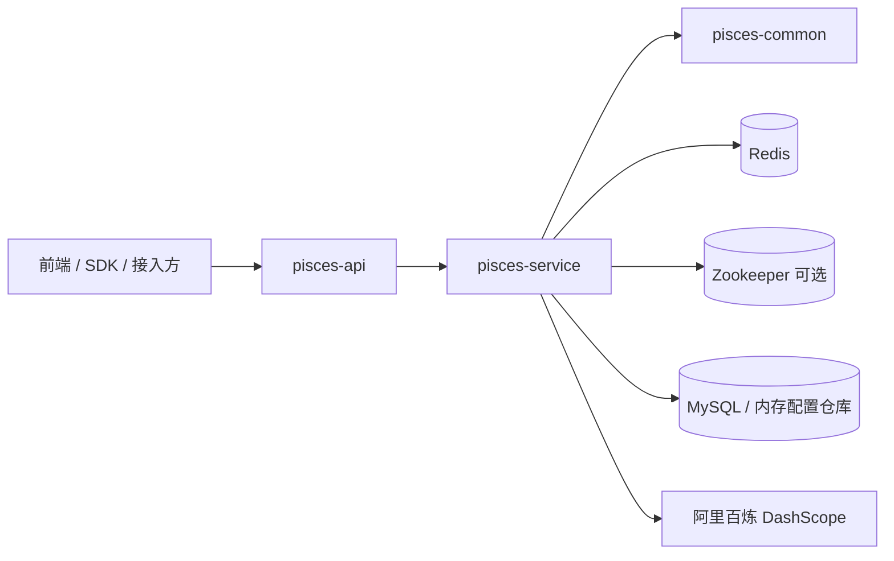

# 架构说明

## 总体结构

## 模块职责

### `pisces-common`

- 实验、实验组、流量、统计、报告等模型
- 请求体和响应体
- `groupConfigSchema` 协议

### `pisces-service`

- 实验主流程
- 数据采集和统计
- 流量分配和 MAB
- AI 设计 / 诊断 / 毕业
- 变体生成
- 演示实验和补数

### `pisces-api`

- 暴露 REST 接口
- 请求日志
- 无用户系统模式下的大部分开放接口

## 核心链路

### 实验创建

1. `ExperimentController` 接收创建请求
2. `ExperimentServiceImpl` 校验实验基础信息
3. `GroupConfigSchemaValidator` 校验 `groupConfigSchema` 和各组 `config`
4. `ConfigServiceImpl` 保存 `ExperimentMetadata`

### 分流

1. `TrafficController` 接收 `experimentId + visitorId + attributes`
2. `TrafficServiceImpl` 读取配置
3. 按策略分配实验组
4. 必要时读取 / 更新 MAB 状态

### 事件与统计

1. `DataController` 接收曝光和事件
2. `DataServiceImpl` 写入事件与计数
3. `AnalysisServiceImpl` 聚合统计、质量检查、对比和报告

### AI 决策

1. `AnalysisController` 进入结构化 AI 接口
2. `AIDecisionServiceImpl` 组装 prompt
3. `TongYiTextGenerationClient` 调用通义文本模型
4. `AIDecisionJsonParser` 解析结构化 JSON
5. `DecisionGuardrailEvaluator` 根据数据质量结果做门禁修正

## 存储边界

- Redis：事件、计数、访客去重、流量缓存、MAB 参数
- Zookeeper：实验配置主存储，可选
- 配置仓库：Zookeeper 不可用时承接配置；当前支持 MySQL 或内存

## 当前约束

- AI 不自动执行实验变更
- 演示实验允许固定数据
- 非演示实验的分析、创建和补数必须走真实数据链路
